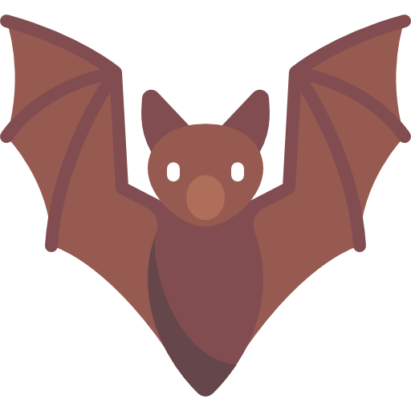
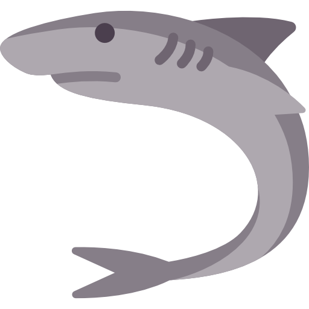

 

# General Presentation
This repository represents the work I've done for one of the 3 assessments at Visual Programming Environments, in 2019, at Transylvania University of Brașov, Romania.

## Purpose
The purpose of this assessment was to implement a windows Hangman videogame, using WPF and C#. The game needed to have additional features besides the game itself, like: user profiles management, data persistence, and statistics.

## Technologies and dependencies
For the implementation of this project I've used the following technologies and dependencies:
- **Visual Studio**: IDE
- **C#**: Programming language
- **[.NET Framework WPF](https://docs.microsoft.com/en-us/dotnet/desktop/wpf/?view=netframeworkdesktop-4.8)**: A free and open-source graphical subsystem originally developed by Microsoft for rendering user interfaces in Windows-based applications

 

# Project Presentation

## User Interface
### Menus
| Main Menu| Statistics|
|:-:|:-:|
| **Profile Creation**| **Profile Selection**|
| **Categories Selection**| **Game**|

 

### Dialog Boxes
| Save Game| Continue Game|
|:-:|:-:|
| **Won Game**| **Lost Gmae**|

## Features
Besides the main hangman game functionality, the user has the benefit of additional features, like:
- **Personalizing his own profile:** When creating a new profile, the user has the possibility to choose a name and a profile icon
- **Saving & resuming game sessions:** When exiting the game, the user can save his current session, just in order to resume it later on
- **Consulting statistics:** The user can consult statistics, comparing his profile with other profiles on the same computer

## Assets
The videogame has numerous audio-visual elements, like:
- **Animated main menu**

-  **Profile icons**

|||||||||||
|:-:|:-:|:-:|:-:|:-:|:-:|:-:|:-:|:-:|:-:|
|||||||||||
|||||||||||

- **Phase-based animated levels**

|||||
|:-:|:-:|:-:|:-:|
|||||

## Project Structure
|Structure|Details|
|:-|:-|
||- **Commands**: WPF Commands - **Models**: used for data manipulation and OOP purposes - **Resources**: static resources and assets used along the project - **ViewModels**: WPF ViewModels where most of the logic is implemented - **Views**: UI views|
